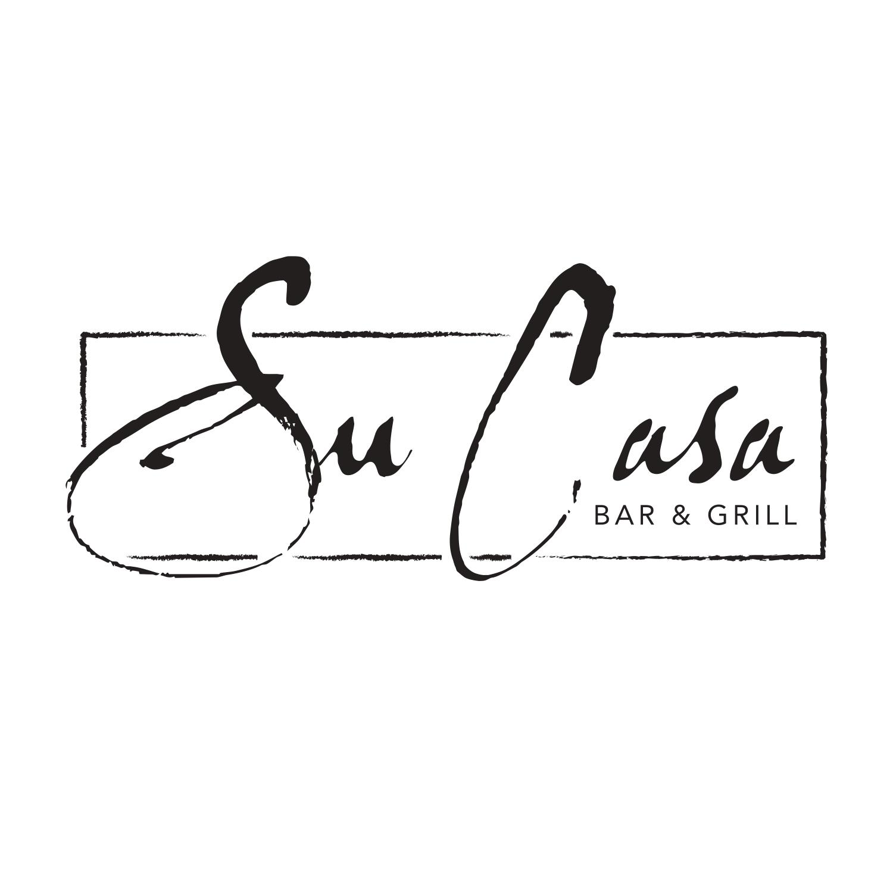

# Sucasa-React-SPA-Project

When you're at Su Casa, you're at home.

## Table of Contents
* [Description](#description)
* [Technologies](#technologies)
* [Link](#link)
* [Contributors](#contributors)
* [Contact](#contact)
* [Repo](#repo)

## Description
Located in beautiful Paso Robles, Su Casa is a family owned and operated latin themed restaurant. We first opened our doors in 2016, and have been proudly serving the Paso Robles community since then! We like to think when you're here, you're in our home. Our goal is to provide a pleasant dining experience for locals and tourists alike, and add our own touch to the Paso Robles life-style!

The Su Casa website features an about page, food and drink menus, a gallery of dishes, drinks, and the restaurant itself, and an events page, where users can leave comments and create discussion about Su Casa events.

## Technologies
* Express
* MongoDB/Mongoose
* React
* CSS
* GraphQL
* JWT
* Bootstrap

## Link
* [https://mighty-taiga-27684.herokuapp.com/](https://mighty-taiga-27684.herokuapp.com/)

## Contributors
* Amir Bahmani
* Alan Lin
* Adam Burpee

## Contact
* Amir: amirb2467@gmail.com
* Alan: alin6120404@gmail.com
* Adam: arburpee@gmail.com

## Repo
* [Github](https://github.com/amirb97/Sucasa-React-SPA-Project)
